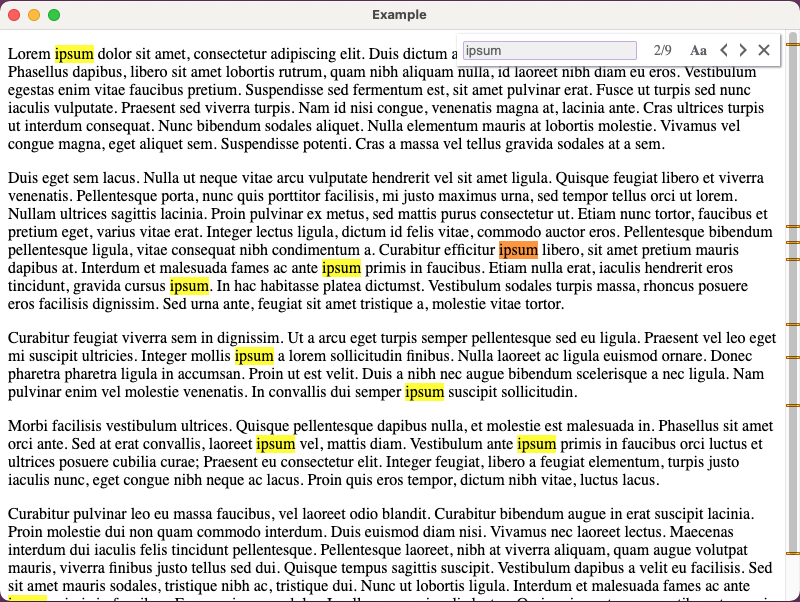

# electron-find
Find all matches for the text in electron app. This fork includes support for electron 13 and other enhancements.

-

## Changes from the Original Repository
- Support recent electron versions by using ipcRenderer instead of webContents
- Fix: Prevent find from starting over when pressing enter in the text box

## Features
- depend on the API of electron's [findInPage](https://www.electronjs.org/docs/api/web-contents#contentsfindinpagetext-options)
- support user config UI of find interface
- support case-sensitive
- Auto find when user inputing is change
- The find interface is separated from electron view
- Verified to work in electron versions 12 and 13
- support platform of Windows, Linux, Mac

## Install
```sh
npm install roddyaj/electron-find --save
```

## Usage

### In Main Process
Call a function like this to add find support to a window:
```javascript
const electron = require('electron');
const { app, BrowserWindow, globalShortcut, ipcMain } = electron;

function addFindSupport(window) {
  window.findListener = (event, text, options) => { window.webContents.findInPage(text, options); };
  window.stopFindListener = (event, action) => { window.webContents.stopFindInPage(action); };
  window.webContents.on("found-in-page", (event, result) => { window.webContents.send("found-in-page", result); });

  const addListeners = () => {
    globalShortcut.register("CommandOrControl+F", () => { window.webContents.send("openFind"); });
    ipcMain.on("find", window.findListener);
    ipcMain.on("stopFind", window.stopFindListener);
  };
  const removeListeners = () => {
    globalShortcut.unregister("CommandOrControl+F");
    ipcMain.removeListener("find", window.findListener);
    ipcMain.removeListener("stopFind", window.stopFindListener);
  };
  window.on("focus", addListeners);
  window.on("blur", removeListeners);
  window.on("closed", removeListeners);
}
```

### In Preload Script
Note, see documentation on [preload scripts](https://www.electronjs.org/docs/tutorial/quick-start#access-nodejs-from-the-renderer-with-a-preload-script) for more information.
```javascript
const { contextBridge, ipcRenderer } = require("electron");

contextBridge.exposeInMainWorld("ipcRenderer", {
  send: (channel, ...args) => {
    ipcRenderer.send(channel, ...args);
  },
  on: (channel, listener) => {
    ipcRenderer.on(channel, listener);
  },
});
```

### In Render Process
```javascript
import { FindInPage } from "electron-find";

const { ipcRenderer } = window;
this.findInPage = new FindInPage(ipcRenderer);
ipcRenderer.on("openFind", (_event, _message) => {
  this.findInPage.openFindWindow();
});
```

## Keyboard Shortcuts
| keys          | function  |
| ------------- | --------- |
| Enter         | find next |
| Shift + Enter | find back |
| Esc           | close     |

## API
```javascript
const findInPage = new FindInPage(webContents, [options])
```
- `webContents` Object (required) - The webContents of renderer process
- `options` Object (optional)
   - `preload` Boolean - Whether load the find interface when create instance. Default is `false`.
   - `parentElement` Object - Specify parent dom of the find interface. Default is `document.body`.
   - `duration` Number - Specify moving time in milliseconds when the find window open or close. Default is `300`.
   - `offsetTop` Number - Specify offset relative to the top of parentElement. Default is `5`.
   - `offsetRight` Number - Specify offset relative to the right of parentElement. Default is `5`.
   - `boxBgColor` String - Specify background color of the find interface. Default is `"#ffffff"`.
   - `boxShadowColor` String - Specify shadow color of the find interface. Default is `"#909399"`.
   - `inputColor` String - Specify text color of the input form. Default is "#606266".
   - `inputBgColor` String - Specify background color of the input form. Default is `"#f0f0f0"`.
   - `inputFocusColor` String - Specify border color of the input form when focusing. Default is `"#c5ade0"`.
   - `textColor` String - Specify color of the text in find interface. Default is `"#606266"`.
   - `textHoverBgColor` String - Specify background color of text in find interface when hovering. Default is `"#eaeaea"`.
   - `caseSelectedColor` String - Specify border color of the matchCase button when selected. Default is `"#c5ade0"`.  

`findInPage.openFindWindow()` - Open the find window when it is closed. Focus input form when the find window has opened.  
`findInPage.closeFindWindow()` - Close the find window when it has opened.  
`findInPage.destroy()` - Close the find window, and release memory.
